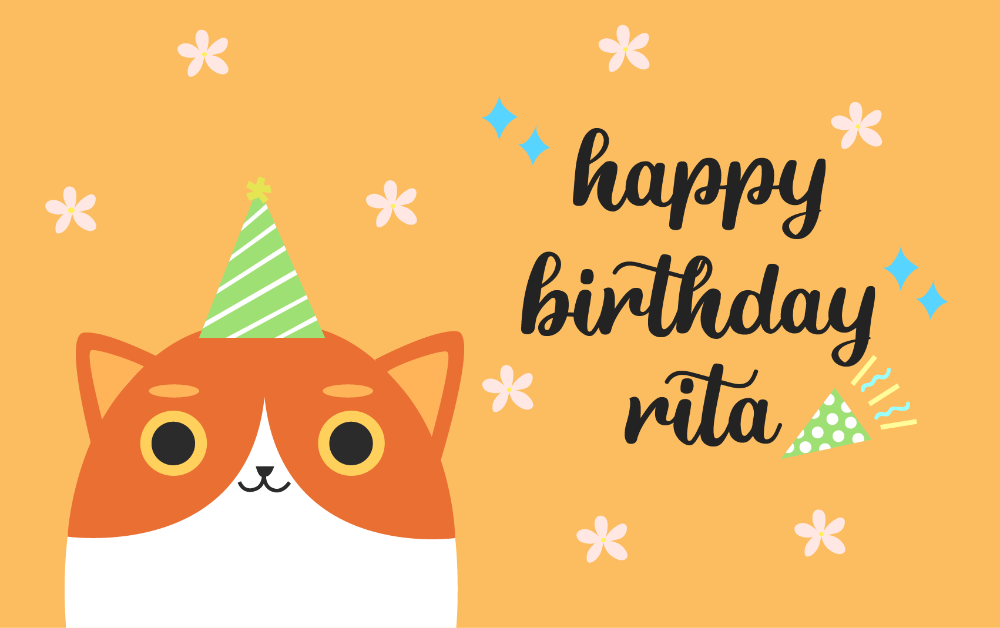
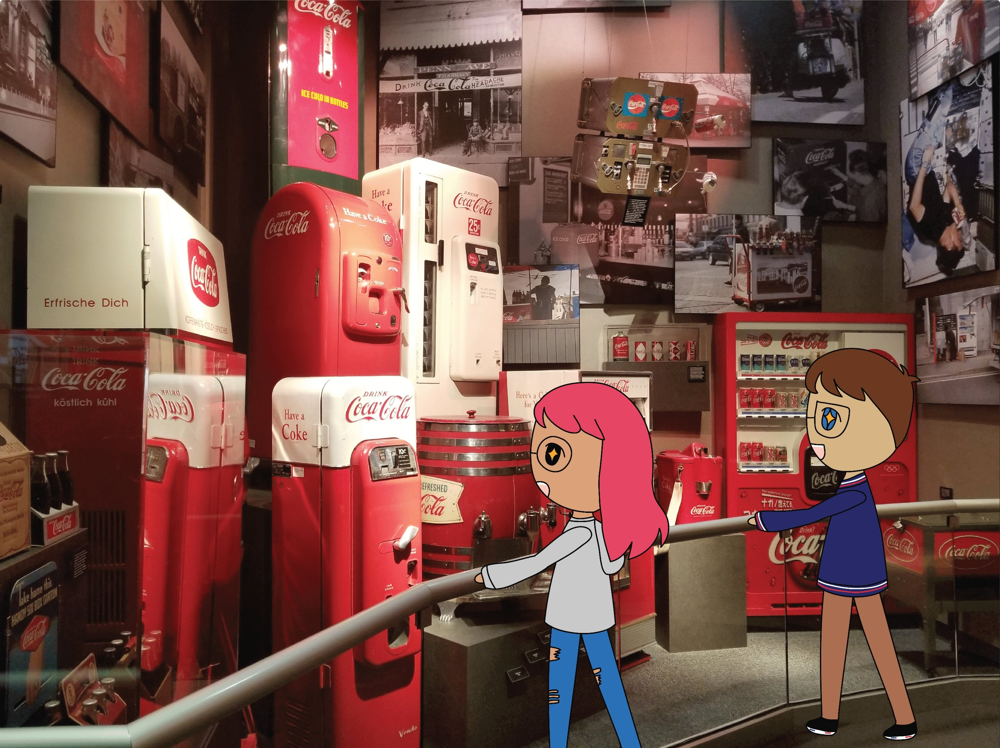

# Illustrations

## Cards

Various cards I've made for my friends and family.

## Animal Crossing Friends

Friends that I drew as Animal Crossing villagers based on their looks and personality!

_Created in early 2020_

## Polaroid Project

A polaroid project I created for my boyfriend's (now husband's) birthday. I used Illustrator to draw on top of photos of places we have been together throughout our relationship. Happy birthday, Nick!

_Created in 2019_

## Pokemon From Memory

Various Pokemon I drew from memory as a drawing prompt. I doodled these from memory without using any references. They may or may not be accurate. It's harder than you think!

_Created in 2019_

## Icons

Icon designs I created for my personal projects.

