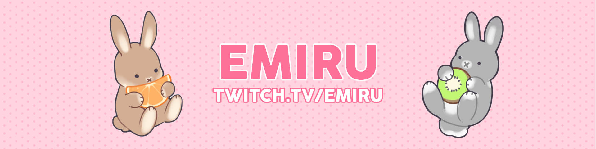
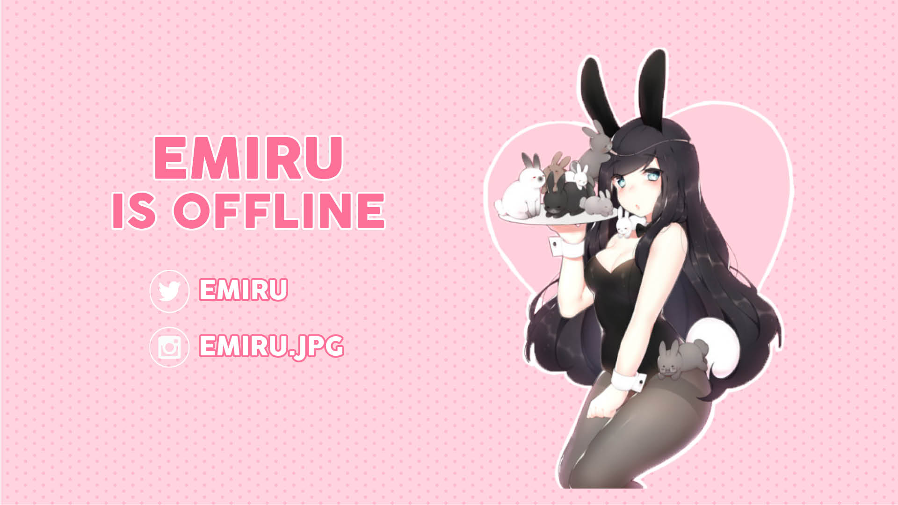

# Graphic Design

## Twitch Layouts

A banner and offline page I created for one of my favourite streamers, Emiru.

_Created in 2018_

## Posters

## Dot To Dot Magazine

A magazine I worked on with 3 other group members revolving around Toronto. The magazine showcases different places to visit on a map, thus Dot to Dot.

_Created in 2017_

